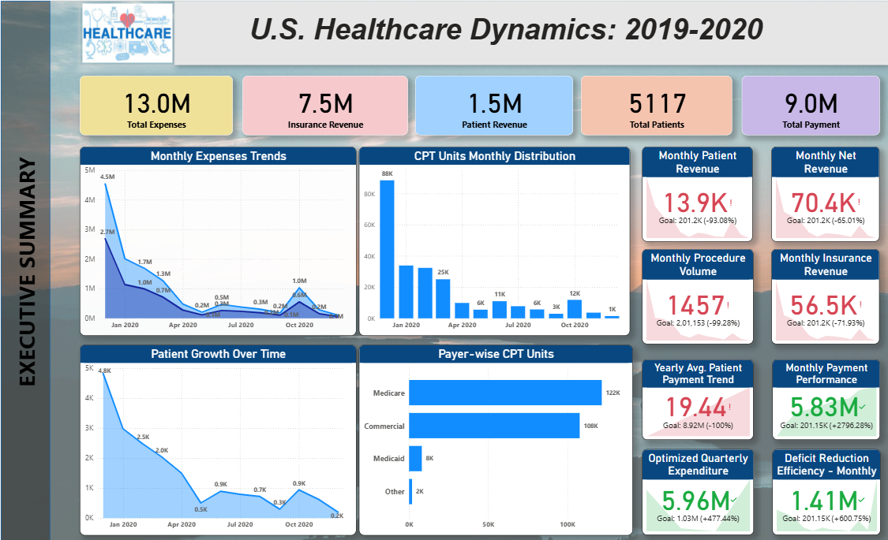

# 🏥 US Healthcare Dynamics – Power BI Project  

## 📌 Overview  
This project **analyzes US healthcare data using Power BI**. It _integrates patients, hospitals, physicians, payers, diagnoses, and procedures with financial adjustments_ to deliver clinical, operational, and financial insights. 
It provides actionable insights into **patients, hospitals, physicians, financial adjustments, and transactions** to support data-driven healthcare decision-making.  

---

## 📊 Data Model  
The schema is designed with a **Fact Table** at the core and multiple **dimension tables**, including:  
- 🏥 **Hospital Lookup** – Hospital details  
- 👨‍⚕️ **Physician Lookup** – Provider information & specialties  
- 🧑‍🤝‍🧑 **Patient Lookup** – Patient demographics & health factors  
- 💊 **Diagnosis & Procedure Codes** – Clinical classifications  
- 💰 **Transaction & Adjustment Tables** – Financial and operational metrics  
- 📅 **Date Dimension** – Enables time-series analysis  

This **star schema** ensures optimized queries, scalability, and powerful visualization capabilities.  

---

## 🔍 Key Insights  
- ✅ Patient demographics and risk factors (age, lifestyle, conditions)  
- ✅ Hospital and physician performance analysis  
- ✅ Specialty-wise healthcare service utilization  
- ✅ Financial impact of **adjustments, debts, and payers**  
- ✅ Time-based trends for treatment and outcomes  

---

## 🚀 Outcomes  
- 📈 Improved visibility into **clinical outcomes and hospital efficiency**  
- 💡 Identified **revenue leakages** through adjustment factors and bad debts  
- 📊 Enabled **healthcare providers** to track trends and optimize services  
- 🩺 Provided insights for **policy planning & resource allocation**  

---

## ⚙️ Tools & Skills Used  
- **Power BI** – Data visualization & dashboards  
- **SQL** – Data extraction and transformation  
- **Data Modeling** – Star schema design (Fact & Dimension tables)  
- **Healthcare Analytics** – Domain-specific metrics and KPIs  

---

## 📸 Project Snapshot  

.
.
.
.

 

---

## 🙌 About  
Developed as part of a **data analytics portfolio project** to demonstrate expertise in:  
- Data cleaning & transformation  
- Healthcare data modeling  
- Power BI dashboarding  
- Analytical storytelling  

---
